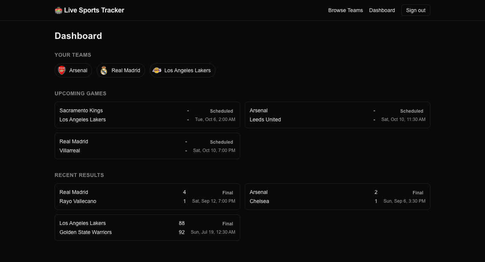
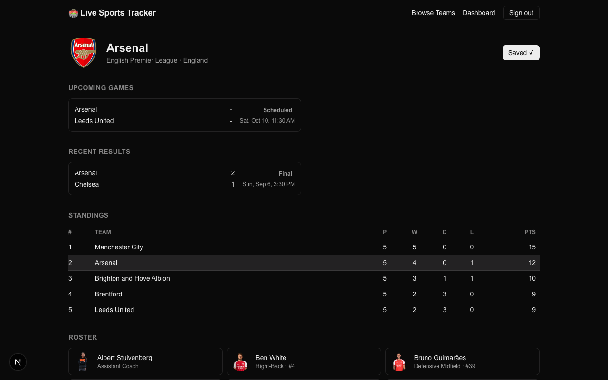
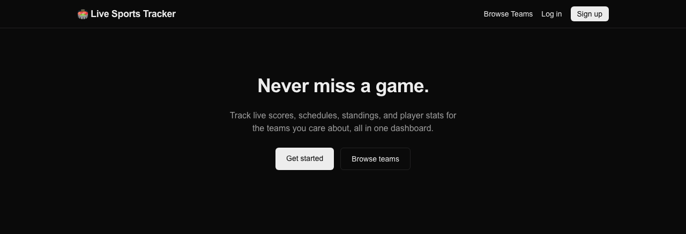
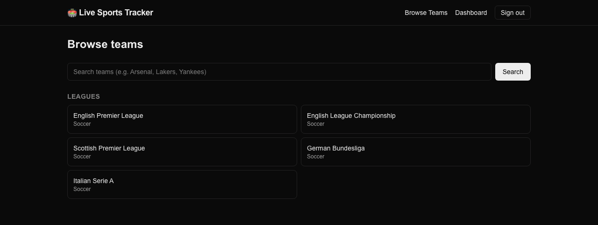

# Live Sports Tracker

Follow your favorite teams: live scores, schedules, standings, and player stats in one dashboard.

## Demo

| Dashboard | Team page |
| --- | --- |
|  |  |

| Home | Browse teams |
| --- | --- |
|  |  |

## Stack

- **Next.js 16** (App Router, Turbopack, React 19)
- **PostgreSQL + Prisma** for the app database (`prisma/schema.prisma`)
- **NextAuth v5** (Credentials provider, JWT sessions, Prisma adapter) for auth
- **TheSportsDB** as the sports data provider (swap for API-Football etc. in `src/lib/sports-api.ts`)
- **SWR** for client-side polling of live scores
- **Tailwind CSS v4**

## Architecture notes

- **Data model** (`prisma/schema.prisma`): `User`, `League`, `Team`, `Player`, `Game`, `Stat`, and the `UserTeam` join table. Teams/leagues are only written to our DB when a user saves them (upserted from the sports API's normalized shape) — everything else (schedules, rosters, standings, live scores) is fetched live and normalized on demand, so our DB never has to be kept in sync with the upstream provider.
- **Data fetching**: server components fetch directly (`src/app/teams/[id]/page.tsx`, `src/app/teams/page.tsx`, `src/app/(dashboard)/dashboard/page.tsx` for the saved-teams list) and route handlers under `src/app/api/**` back client-side interactivity (saving/unsaving teams, polling live games).
- **Caching / rate limits**: `src/lib/sports-api.ts` wraps every upstream call in Next's `fetch` cache with a `revalidate` window tuned to how often that data actually changes — metadata (leagues/teams/players) for hours, schedules/standings for minutes, live scoreboards for ~20s. This keeps concurrent users sharing one upstream request instead of hitting the provider per-request.
- **Real-time updates**: `src/hooks/useLiveGames.ts` polls `/api/games/live` via SWR every 25s. `src/components/LiveScoreBanner.tsx` diffs consecutive polls to raise in-app toast notifications on kickoff / goals / full-time for the signed-in user's saved teams. `src/app/api/notify/route.ts` + `vercel.json` wire up an optional hourly cron for game-day emails via Resend (no-op if `RESEND_API_KEY` isn't set).
- **Auth**: `src/auth.ts` (NextAuth v5), `src/proxy.ts` (Next 16's renamed `middleware.ts`) protects `/dashboard/**`.

## Getting started

1. **Install dependencies**

   ```bash
   npm install
   ```

2. **Start Postgres** (or point `DATABASE_URL` at any Postgres instance)

   ```bash
   docker run -d --name lst-postgres -e POSTGRES_PASSWORD=postgres -e POSTGRES_DB=live_sport_tracker -p 5432:5432 postgres:16-alpine
   ```

3. **Configure environment variables**

   ```bash
   cp .env.example .env
   ```

   Fill in `AUTH_SECRET` (`openssl rand -base64 32`). The default `SPORTS_API_KEY=3` is TheSportsDB's public test key and works out of the box for development; `RESEND_API_KEY` is optional.

4. **Run migrations**

   ```bash
   npm run db:migrate
   ```

5. **Start the dev server**

   ```bash
   npm run dev
   ```

   Visit `http://localhost:3000`.

## Scripts

- `npm run dev` / `npm run build` / `npm run start`
- `npm run db:migrate` – create/apply a migration in dev
- `npm run db:push` – push schema without a migration (quick prototyping)
- `npm run db:studio` – Prisma Studio

## Known scaffold limitations

- The sports API integration targets TheSportsDB's free tier, which has limited true "live" (minute-by-minute) coverage; the normalized types in `src/types/index.ts` are provider-agnostic, so swapping to a paid provider like API-Football only touches `src/lib/sports-api.ts`.
- `/api/notify` doesn't yet persist which game/user pairs have been emailed, so a production deployment should add a small `NotificationLog` table to dedupe across cron runs.
