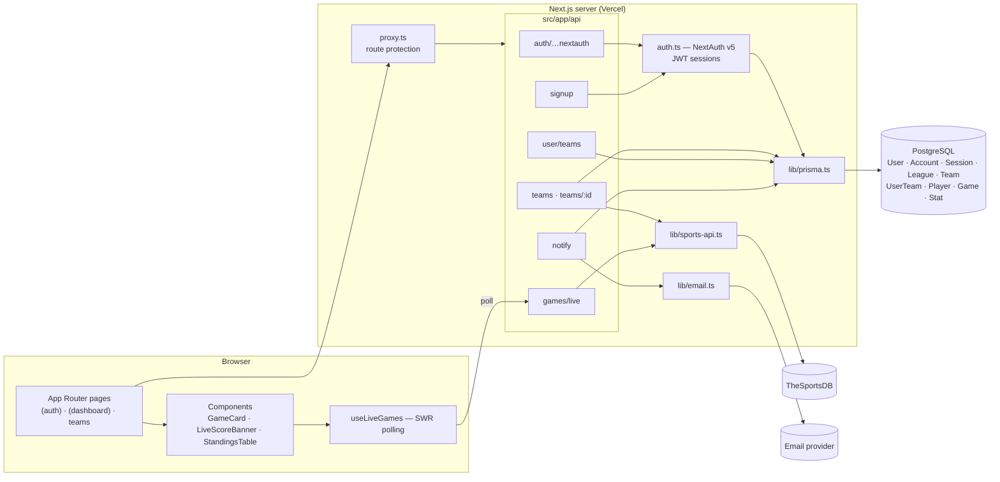

# Architecture

A Next.js 16 (App Router) app with PostgreSQL/Prisma, NextAuth credentials auth, and TheSportsDB as the data provider. Live scores are polled client-side with SWR.

```mermaid
flowchart LR
    subgraph Browser
        Pages["App Router pages<br/>(auth) · (dashboard) · teams"]
        Comp["Components<br/>GameCard · LiveScoreBanner · StandingsTable"]
        Hook[useLiveGames — SWR polling]
        Pages --> Comp --> Hook
    end

    subgraph Server["Next.js server (Vercel)"]
        Proxy[proxy.ts<br/>route protection]
        Auth["auth.ts — NextAuth v5<br/>JWT sessions"]
        subgraph API["src/app/api"]
            A1[auth/…nextauth]
            A2[signup]
            A3[teams · teams/:id]
            A4[user/teams]
            A5[games/live]
            A6[notify]
        end
        Sports["lib/sports-api.ts"]
        Email["lib/email.ts"]
        Prisma["lib/prisma.ts"]
    end

    DB[(PostgreSQL<br/>User · Account · Session · League · Team<br/>UserTeam · Player · Game · Stat)]
    TSDB[(TheSportsDB)]
    Mail[(Email provider)]

    Pages --> Proxy --> API
    Hook -->|poll| A5
    A1 & A2 --> Auth --> Prisma
    A3 & A4 --> Prisma --> DB
    A3 & A5 --> Sports --> TSDB
    A6 --> Email --> Mail
    A6 --> Prisma
```
